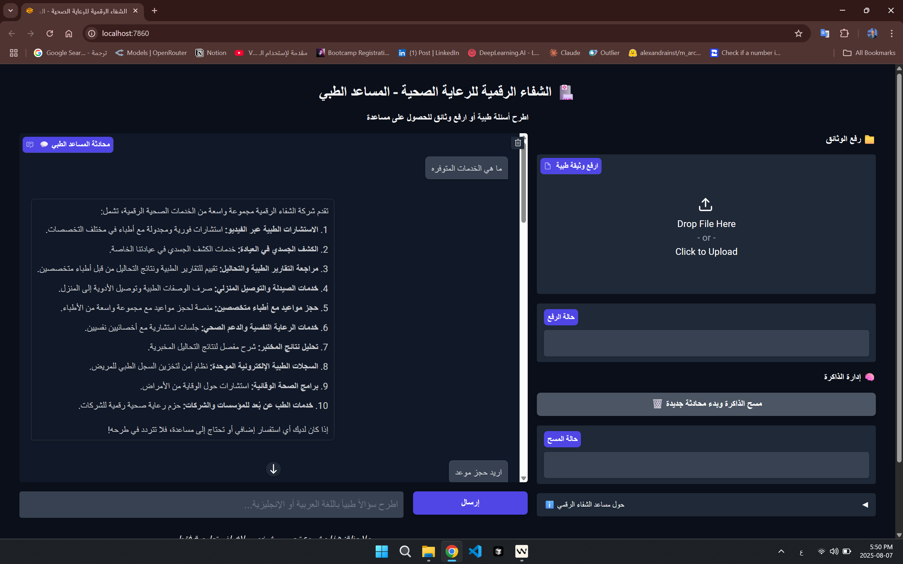

# Agentic Medical RAG Chatbot

A Retrieval-Augmented Generation (RAG) based medical chatbot with agentic capabilities. This project leverages advanced language models and vector search to provide accurate, context-aware answers to medical queries, using both company-specific and general medical knowledge.

## Table of Contents  

- [Features](#features)
- [Demo](#demo)
- [Project Structure](#project-structure)
- [Installation](#installation)
- [Usage](#usage)
- [Data Preparation](#data-preparation)
- [Customization](#customization)
- [Contributing](#contributing)
- [License](#license)

---

## Features

- **Retrieval-Augmented Generation (RAG):** Combines LLMs with a vector store for contextually relevant answers.
- **Agentic Reasoning:** Supports multi-step reasoning and tool use for complex queries.
- **Medical Domain Focus:** Designed for medical FAQs, company info, and general health questions.
- **Extensible:** Modular codebase for easy adaptation to new data sources or domains.

---

## Demo

[Watch the demo on YouTube](https://www.youtube.com/watch?v=MuRdFiiDmf0)

[Try the live demo on Hugging Face](https://huggingface.co/spaces/moazx/Agentic-Medical-RAG-Chatbot)



---

## Show Experimentations

[](
https://colab.research.google.com/drive/14Dy79AxKPHf-7X0C5gkTs-GyobPLtudy?usp=sharing)
[](
https://www.kaggle.com/code/moazeldsokyx/agentic-medical-rag-chatbot-for-an-arabic-company)

---

## Project Structure

```
Agentic-Medical-RAG-Chatbot/
│
├── app.py                      # Main entry point for the chatbot app
├── src/
│   ├── agent.py                # Agent logic and orchestration
│   ├── config.py               # Configuration settings
│   ├── data_loaders.py         # Data loading utilities
│   ├── retriever.py            # Vector store retriever logic
│   ├── text_processor.py       # Text preprocessing and chunking
│   ├── tools.py                # Tool definitions for agent
│   ├── utils.py                # Utility functions
│   └── vector_store.py         # Vector store management 
│
├── data/
│   ├── raw_company_info/       # Raw data 
│   └── processed/              # Processed data and vector indices
│
├── assets/                     # Images and other assets
├── requirements.txt            # Python dependencies
├── README.md                   
└── LICENSE
```

---

## Installation

1. **Clone the repository:**
   ```bash
   git clone https://github.com/MoazEldsouky/Agentic-Medical-RAG-Chatbot.git
   cd Agentic-Medical-RAG-Chatbot
   ```

2. **Create a virtual environment (optional but recommended):**
   ```bash
   python -m venv venv
   source venv/bin/activate  # On Windows: venv\Scripts\activate
   ```

3. **Install dependencies:**
   ```bash
   pip install -r requirements.txt
   ```

4. **Run the Chatbot:**

   ```bash
   python app.py
   ```


### 3. Using Docker (Alternative)

You can also build and run the application using Docker.

**Build the image:**
```bash
docker build -t agentic-medical-rag-chatbot .
```

**Run the container:**
Make sure you have a `.env` file in the root directory with your environment variables (e.g., `OPENAI_API_KEY`).
```bash
docker run --name agentic-medical-rag-chatbot-app --env-file .env -p 7860:7860 agentic-medical-rag-chatbot
```

**Pull from Docker Hub:**
Alternatively, you can pull the pre-built image from Docker Hub.
```bash
docker pull moazz/agentic-medical-rag-chatbot:latest
```
Then run the container using the pulled image:
```bash
docker run --name agentic-medical-rag-chatbot-app --env-file .env -p 7860:7860 moazz/agentic-medical-rag-chatbot:latest
```

---


## Customization

- **Add New Tools:** Implement new tools in `src/tools.py` and register them with the agent.
- **Change Model or Retriever:** Modify `src/agent.py` and `src/vector_store.py` to use different LLMs or vector databases.
- **UI/UX:** Integrate with a web frontend or other interfaces as needed.

---

## Contributing

Contributions are welcome! Please open issues or pull requests for improvements, bug fixes, or new features.

---

## License

This project is licensed under the [MIT License](LICENSE).

---


---
